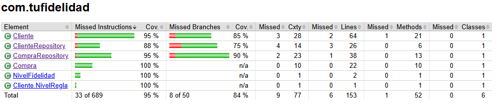
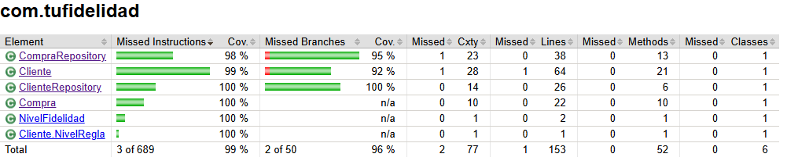

# Tarjeta-de-Fidelidad-Gamificada

## Diseño del sistema

A continuación se presenta el diseño inicial del sistema en formato UML:


### Consideraciones de diseño

- **Cliente**: entidad principal que almacena puntos, nivel de fidelidad y racha de días consecutivos. Aplica lógica de validación de correo, cálculo de nivel y actualización de racha.
- **Compra**: representa una compra individual. Calcula puntos base y bonificados según el nivel del cliente.
- **NivelFidelidad**: enum que encapsula los niveles `BRONCE`, `PLATA`, `ORO`, `PLATINO`.
- **ClienteRepository / CompraRepository**: almacenan clientes y compras en memoria. Manejan operaciones de CRUD y consultas filtradas.

---

## Stack de Tecnologías 

| Herramienta                   | Versión | Propósito                                            |
| ----------------------------- | ------- | ---------------------------------------------------- |
| **Java**                      | 21      | Lenguaje de programación principal                   |
| **Maven**                     | 3.9.10  | Gestión de dependencias, ejecución y ciclos de build |
| **JUnit Jupiter (JUnit 5)**   | 5.10.0  | Framework para pruebas unitarias                     |
| **JaCoCo (via Plugin Maven)** | 0.8.10  | Generación de reportes de cobertura de código        |


---

## Instrucciones de compilación y ejecución

### Dirígete a la raíz del proyecto:

```bash
cd tarjeta-fidelidad
````

### Compilación y ejecución del programa principal

```bash
mvn compile exec:java -Dexec.mainClass="com.tufidelidad.App"
```

### Ejecución de pruebas unitarias

```bash
mvn clean test
```

### Generación de reporte de cobertura con JaCoCo

```bash
mvn clean verify -DskipTests=false -Dmaven.test.failure.ignore=true
```

### Ubicación de los reportes JaCoCo

```bash
target/site/jacoco/index.html
```

---

## Comparación de cobertura

### Cobertura obtenida usando solo **TDD**:



* **Cobertura de instrucciones**: 95%
* **Cobertura de ramas**: 84%
* **Pruebas pasadas**: 100%

---

### Cobertura final con **suite de pruebas agresiva**:



* **Cobertura de instrucciones**: 99%
* **Cobertura de ramas**: 96%
* **Pruebas pasadas**: 85%

---

## 🧪 Ejemplo de salida de pruebas

### Solo TDD:

```text
[INFO] Tests run: 38, Failures: 0, Errors: 0, Skipped: 0
```

### Con suite agresiva de pruebas:

```text
[INFO] Tests run: 79, Failures: 12, Errors: 0, Skipped: 0

[ERROR] Failures:
- ClienteTest.agregarBonusPorTresComprasEnElMismoDia
- ClienteTest.agregarCompraConFechaFuturaNoDeberiaPermitirlo
- ClienteTest.noDebePermitirNombreVacio
- CompraTest.noDebePermitirMontoNegativo
- CompraRepositoryTest.registrarCompraConFechaFuturaDebeLanzarExcepcion
...
```

Al implementar TDD, el desarrollo se apoya en tests creados internamente, buscando abarcar los flujos típicos y situaciones habituales al crear el sistema. Esto facilitó la verificación temprana de clases y métodos esenciales, confirmando que las funciones primordiales actuaban según lo planeado.

Aunque inicialmente se obtuvo una ejecución perfecta de 38 pruebas sin fallos , la cobertura del código alcanzaba solo un 95% lo que indica que ciertos caminos lógicos no estaban siendo evaluados.  Al introducir una suite más extensa con 79 pruebas, surgieron 12 fallos, pero se elevó la cobertura al 99%. Esta reducción en la cantidad de pruebas exitosas no representa un retroceso, sino una mejora ya que los fallos revelan validaciones ausentes, casos límite no contemplados y errores silenciosos que pasaban desapercibidos en la primera etapa. Por lo tanto para este caso es mas conveniente tener mas fallos para una mayor covertura.

TDD no siempre anticipa cada posible situación, sobre todo al tratar validaciones, datos incorrectos o límites. Por ello, se agrega un conjunto exhaustivo de pruebas para cubrir la cobertura, diseñado para encontrar fallos sutiles, errores inadvertidos y rutas no consideradas antes.

---

## Flujo de trabajo TDD aplicado

Se siguió el ciclo clásico del desarrollo guiado por pruebas:

1. **Red** `test`: escribir una prueba que falla.
2. **Green** `feat`: implementar el código mínimo para que pase la prueba.
3. **Refactor** `refactor`: mejorar el código sin romper las pruebas.

---

## Organización de ramas

Durante el desarrollo, se aplicó una convención clara de ramas basada en funcionalidades en el siguiente orden:

* `feature/cliente`
* `feature/compra`
* `feature/metodos-usuario`
* `feature/menu-interactivo`

Cada rama correspondía a una parte del sistema y sus pruebas asociadas. Una vez completada, se mergeaba a `develop`, y finalmente a `main`.

---

## ¿Qué tipo de cobertura fue medida y por qué?

Se utilizó **JaCoCo** para medir dos tipos principales de cobertura:

* **Instrucciones (Instruction Coverage)**: mide cuántas instrucciones bytecode fueron ejecutadas al menos una vez.
* **Ramas (Branch Coverage)**: mide si todas las decisiones condicionales (`if`, `for`, `switch`, etc.) fueron evaluadas en ambas direcciones (`true` y `false`).

Se diseñó la suite de pruebas con el objetivo de maximizar la cobertura de código al máximo posible con validaciones, condiciones límite y caminos alternativos. Sin embargo, existen ciertas secciones que no pudieron ser cubiertas, como por ejemplo el cálculo de beneficios por nivel de fidelidad. Esto se debe a que el código está preparado para la futura inserción de más niveles, manteniendo una arquitectura extensible, aunque actualmente solo se han definido los niveles estándar previstos. Por lo tanto, algunas ramas y condiciones asociadas a niveles aún no existentes quedaron sin ejecución durante las pruebas.

---

## Otras consideraciones del curso

* El proceso de TDD fue lento en una primera instancia, ya que era la primera vez aplicándolo de forma estricta. Sin embargo, resultó muy efectivo para diseñar correctamente las clases base del dominio como el `Cliente`, `Compra` y `Repositorios` y permitió construir el menú interactivo con una lógica ya validada, sin necesidad de hacer correcciones significativas si las hubiera diseñado de cero.

* Se aplicó el uso de GitFlow para la gestión de versiones, con ramas definidas por funcionalidades que luego de comprobar su funcionamiento se integraban a develop y finalmente a main.

* Se desarrolló una suite de pruebas unitarias, incluyendo pruebas agresivas y de borde para simular escenarios realistas y validar los comportamientos esperados.

**A futuro, este sistema podría complementarse con pruebas end-to-end o de aceptación automatizadas, especialmente orientadas a validar el flujo completo del menú interactivo y la experiencia del usuario, verificando casos integrados desde la entrada hasta la respuesta final del sistema.**