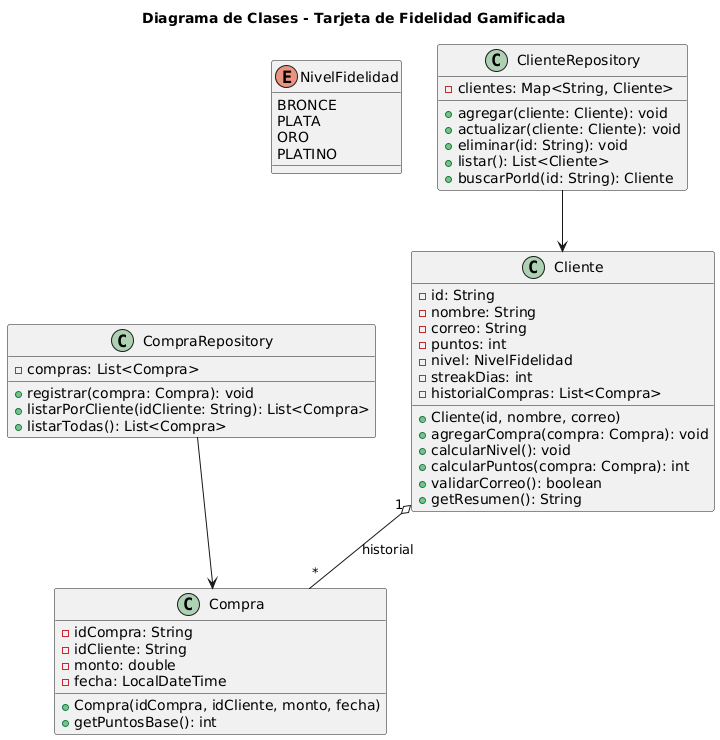

# Tarjeta-de-Fidelidad-Gamificada

## Diseño del sistema

A continuación se presenta el diseño inicial del sistema en formato UML:

### Consideraciones
- Cliente: entidad central. Contiene lógica de puntos, nivel, y validación de correo.
- Compra: cada compra tiene un monto, fecha y otorga puntos base.
- NivelFidelidad: enum para facilitar la lógica de bonificación por nivel.
- ClienteRepository y CompraRepository: almacenan los datos en memoria.
